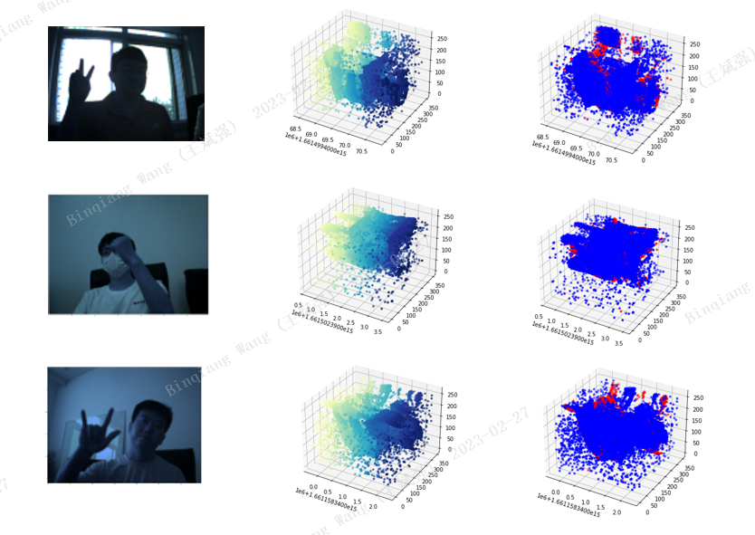
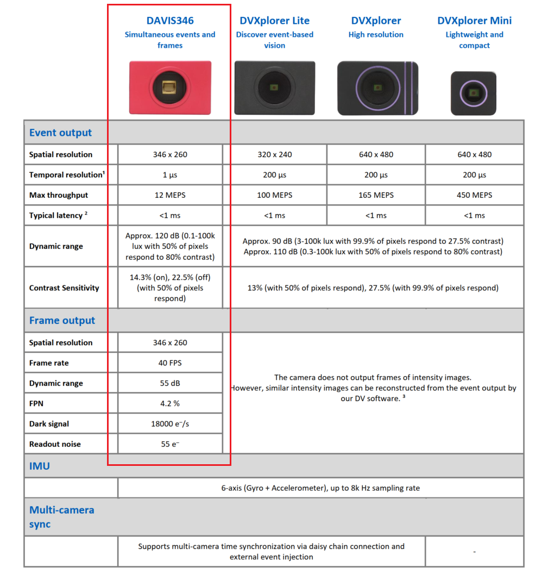

# SGED
Spiking Gesture Emotion Dataset
 
 
This is a dataset for multimodal emotion recognition recorded with DAVIS346. In particular, it refers to video stream data and event stream data. By integrating the semantic information of video frame data and the dynamic information of event stream data, we can better capture the emotional tendency transferred by human gestures. It can promote the development of event flow information processing technology.

## Dataset Description
Different postures that can convey positive, negative and neutral emotions were selected and volunteers were recruited for data collection. In order to enhance the diversity of data, we set different collection scenarios.


The above figure shows three samples from the data set. The first column is a video image of a certain frame, the second column represents the evolution of the event color from yellow to blue over time, and the third column is an event with different polarity. Blue represents the positive polarity of the event, and red represents the negative polarity of the event.

## Data Format and usage
In order to protect the privacy of volunteers, we adopted a questionnaire survey to decide the degree of the released dataset (whether to issue data containing facial information of volunteers).

According to the survey results, we published the original data of some volunteers, while the data of other volunteers were published in our own format.

In order to protect the privacy of facial information, for volunteers who do not want to be disclosed, we directly use the pre-training deep learning model to extract feature vectors to replace the original data.

The original data is the data output by the camera (the file suffix is aedat4). We have given the annotation text of the fixed event stream.

ALL the data can be download from https://pan.baidu.com/s/1-xHKwlcK7E4xbBljKWL7Lg 
Extraction code：1s9x


Original data format and usage:
```
to_show_img = xxx
with AedatFile(to_show_img) as f:
for frame in f['frames']:
	xxx

with AedatFile(aedat_path) as f:
    events_data = f['events']
data = events_data.numpy()
events = np.hstack([packet for packet in data])

```

Processed data and usage:

After processing, we extracted different features, which are represented by a dictionary. Each sample in the data set has an id. Here, the EfficientNet network is used for feature extraction. The feature output of b0 and b7 layers is extracted respectively. The output feature dimension of each layer is 1000, and the array record is used. The overall feature data format is as follows:

fea_ Dic (data structure is dictionary)

---idx: sample id

---fea-dic: sample feature, size NX2X1000, where N is determined according to the video frame data contained in each aedat4 file.


## Data Acquisition
The device we use is the DAVIS346COLOR version. The camera related parameters are set as follows:

By designing the application scenario, we decided to adopt a dynamic posture that can convey emotions, which is convenient for recording dynamic event flow data. The output of our equipment depends on the software configured with the DAVIS346. Please refer to the following contents for the specific operation process of the software.

Official documentation: https://inivation.gitlab.io/dv/dv-docs/docs/getting-started.html

Or our records:
## Notes
* This data set can only be used for academic research and is strictly prohibited for commercial use!
* If this data set is used, please cite the following papers:
```bibtex
@inproceedings{20230613559916 ,
language = {English},
copyright = {Compilation and indexing terms, Copyright 2023 Elsevier Inc.},
copyright = {Compendex},
title = {Spiking Emotions: Dynamic Vision Emotion Recognition Using Spiking Neural Networks},
journal = {CEUR Workshop Proceedings, International Conference on Algorithms, High Performance Computing and Artificial Intelligence, AHPCAI},
author = {Wang, Binqiang and Dong, Gang and Zhao, Yaqian and Li, Rengang and Yang, Hongbin and Yin, Wenfeng and Liang, Lingyan},
volume = {3331},
year = {2022},
pages = {50 - 58},
issn = {16130073},
address = {Virtual, Online, China},
} 

@article{wang2023sged,
	title={SGED: A Benchmark dataset for Performance Evaluation of Spiking Gesture Emotion Recognition},
	author={Wang, Binqiang and Dong, Gang and Yaqian, Zhao and Rengang, Li and Lu, Cao and Lihua, Lu},
	journal={arXiv preprint arXiv:2304.14714},
	year={2023}
}
```


